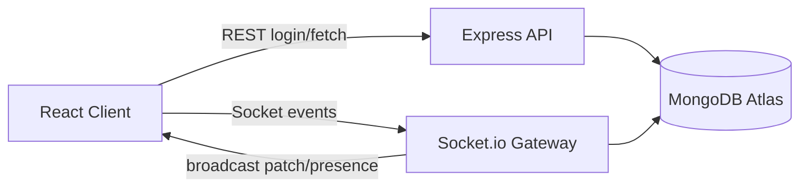

# Notion-lite Real-Time Collaboration Platform (MERN + Socket.io)

Production-oriented starter for collaborative document editing with JWT auth, role-based access, version history, autosave, and live collaboration.

## 1) Folder Structure

```txt
.
├── backend
│   ├── package.json
│   └── src
│       ├── config
│       │   ├── db.js
│       │   └── env.js
│       ├── controllers
│       │   ├── authController.js
│       │   └── documentController.js
│       ├── middleware
│       │   ├── authMiddleware.js
│       │   └── documentAccess.js
│       ├── models
│       │   ├── Document.js
│       │   └── User.js
│       ├── routes
│       │   ├── authRoutes.js
│       │   └── documentRoutes.js
│       ├── services
│       │   └── documentSyncService.js
│       ├── socket
│       │   └── index.js
│       ├── utils
│       │   └── jwt.js
│       └── server.js
└── frontend
    ├── package.json
    └── src
        ├── components
        │   ├── Editor.jsx
        │   ├── Sidebar.jsx
        │   └── Toolbar.jsx
        ├── context
        │   ├── AuthContext.jsx
        │   └── SocketContext.jsx
        ├── pages
        │   ├── Dashboard.jsx
        │   ├── DocumentPage.jsx
        │   └── Login.jsx
        ├── router
        │   └── AppRouter.jsx
        ├── services
        │   ├── api.js
        │   └── socket.js
        └── styles
            └── app.css
```

## 2) Scalable Architecture Diagram Explanation

- **Client (React + Vite):**
  - Initial auth/login and initial document reads use REST APIs.
  - Live editing/presence uses Socket.io.
- **API/Realtime Layer (Express + Socket.io):**
  - JWT is verified for HTTP middleware and Socket.io handshake.
  - RBAC (owner/editor/viewer) is enforced per-document on protected routes and socket room join.
- **Data Layer (MongoDB Atlas):**
  - Primary current document in `content + version`.
  - Embedded `versions[]` snapshots for restore.
  - Embedded `activityLog[]` entries for audit trail.
- **Autosave strategy:**
  - Edits are acknowledged instantly over sockets.
  - DB writes are debounced every ~3s to avoid write amplification.



## 3) MongoDB Schema Design

- **User**: name, email (unique), passwordHash.
- **Document**:
  - `title`, `content`, `version`, `lastSavedAt`
  - `owner`
  - `collaborators[]` with role (`owner|editor|viewer`)
  - `inviteToken`
  - `versions[]` snapshots for restore
  - `activityLog[]` events for auditing

## 4) Real-time Synchronization Logic

1. User opens document and joins socket room (`document:join`).
2. On edit, client emits `document:edit` with `baseVersion` and new content.
3. Server validates current version:
   - If mismatch, emits `document:conflict` with canonical server content/version.
   - If valid, increments version and broadcasts `document:patch`.
4. Autosave service debounces persistence and appends version/activity snapshots.

## 5) Conflict Resolution Strategy

Current implementation uses **version-check optimistic concurrency**:

- Each edit includes `baseVersion`.
- Server accepts edit only if `baseVersion === doc.version`.
- Otherwise server rejects and provides canonical content/version.

This is simple, deterministic, and enough for v1. For richer granular editing, evolve toward OT or CRDT.

## 6) JWT Authentication Flow

1. `POST /api/auth/login` returns JWT.
2. Frontend stores token and sets `Authorization: Bearer ...` for REST.
3. Socket client passes token in handshake `auth.token`.
4. Backend verifies token for both REST middleware and socket middleware.

## 7) Protected Routes

- **Frontend**: router guard redirects unauthenticated users to `/login`.
- **Backend**:
  - `requireAuth` validates JWT.
  - `attachDocument` validates user access to target doc.
  - `requireRole` enforces owner/editor-only actions (share, restore).

## 8) API Endpoints

### Auth
- `POST /api/auth/register`
- `POST /api/auth/login`

### Documents (JWT protected)
- `GET /api/documents`
- `POST /api/documents`
- `GET /api/documents/:id`
- `POST /api/documents/:id/share`
- `POST /api/documents/:id/restore/:version`
- `POST /api/documents/join/:token`

## 9) Security + Rate Limiting

- `helmet()` for secure headers.
- `cors()` pinned to allowed client origin.
- Global rate limiter (`300 req / 15min`).
- JWT verification on both API and socket layers.
- Role checks for sensitive operations.
- Password hashing via bcrypt.

## 10) Deployment Plan (Render + Vercel + Atlas)

### Backend on Render
1. Create Web Service from `backend/`.
2. Build command: `npm install`
3. Start command: `npm start`
4. Set env vars from `backend/.env.example`.
5. Allow CORS origin to Vercel frontend URL.

### Frontend on Vercel
1. Import repo and set root directory `frontend/`.
2. Build command: `npm run build`
3. Output directory: `dist`
4. Set `VITE_API_URL` and `VITE_SOCKET_URL` to Render URL.

### MongoDB Atlas
1. Create cluster and DB user.
2. Add Render outbound IP allowlist (or temporary `0.0.0.0/0` during testing).
3. Set `MONGO_URI` in Render service.

## Core Features Implemented

- Multi-user real-time edits
- Live patch broadcast
- Autosave debounce
- JWT auth + socket auth
- RBAC (`owner`, `editor`, `viewer`)
- Invite-link join flow
- Activity log events
- Version history restore endpoint

## Local Run

```bash
# backend
cd backend
cp .env.example .env
npm install
npm run dev

# frontend
cd ../frontend
cp .env.example .env
npm install
npm run dev
```

Open `http://localhost:5173`.

## Run 100% in GitHub Codespaces (No Local Machine Setup)

Yes — this project can run fully in Codespaces.

### 1) Open in Codespaces

1. Push this repo to GitHub.
2. In GitHub: **Code** → **Codespaces** → **Create codespace on branch**.
3. Wait until the web VS Code instance is ready.

### 2) Configure environment variables in the Codespace terminal

```bash
cp backend/.env.example backend/.env
cp frontend/.env.example frontend/.env
```

Edit `backend/.env` and set:

- `MONGO_URI` (Atlas connection string)
- `JWT_SECRET` (strong random value)
- `CLIENT_URL` (set after forwarding frontend port, usually `https://<codespace>-5173.app.github.dev`)

Edit `frontend/.env` and set:

- `VITE_API_URL` to your forwarded backend URL + `/api` (usually `https://<codespace>-5000.app.github.dev/api`)
- `VITE_SOCKET_URL` to your forwarded backend URL (usually `https://<codespace>-5000.app.github.dev`)

### 3) Install dependencies

```bash
cd backend && npm install
cd ../frontend && npm install
```

### 4) Run backend + frontend (two terminals)

Terminal A:

```bash
cd /workspaces/Notion/backend
npm run dev
```

Terminal B:

```bash
cd /workspaces/Notion/frontend
npm run dev -- --host 0.0.0.0 --port 5173
```

### 5) Forward ports in Codespaces

- Forward **5000** (backend)
- Forward **5173** (frontend)

Set both to visibility needed for your testing (Private is usually fine when using same browser session).

### 6) Important checks for sockets in cloud URLs

- Ensure `CLIENT_URL` in backend exactly matches forwarded frontend URL origin.
- Ensure frontend `VITE_SOCKET_URL` points to forwarded backend origin.
- If live updates fail, verify CORS mismatch first.

### Single-command helper (optional)

If you want to start both quickly in one terminal:

```bash
cd /workspaces/Notion
(cd backend && npm run dev) &
(cd frontend && npm run dev -- --host 0.0.0.0 --port 5173) &
wait
```
